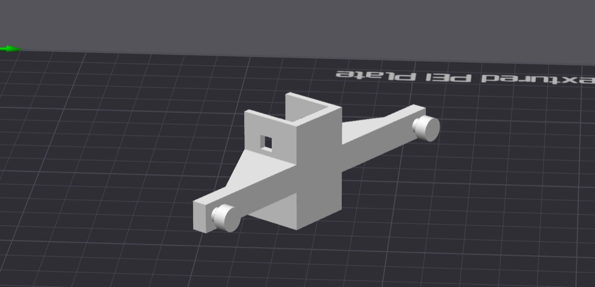

# Ruckus AP HomeRacker Mount

[](https://github.com/nelsonjchen/ruckus-ap-homeracker-mount-openscad/actions/workflows/build-stl.yml)

[OpenSCAD](https://openscad.org/) source for mounting Ruckus wireless access
points to a [HomeRacker](https://github.com/kellerlabs/homeracker) bar.

The current model combines a HomeRacker sleeve with a Ruckus AP prong mount
prototype. It uses a segmented sleeve around a 15 mm HomeRacker support/bar,
standard 4 mm lock-pin holes, and a sideways Ruckus prong strip with printable
gussets under the prong-to-mount connection.

## Status

This is a working Ruckus AP HomeRacker mount prototype.

Generated STL artifacts will be published through GitHub releases:
[ruckus-ap-homeracker-mount-openscad releases](https://github.com/nelsonjchen/ruckus-ap-homeracker-mount-openscad/releases)

Published print profile:
[Ruckus AP HomeRacker Mount on MakerWorld](https://makerworld.com/en/models/2776338-ruckus-ap-homeracker-mount#profileId-3084819)

## Required Print Orientation

Print the part sideways in the exported/default STL orientation. Do not use
slicer auto-orient.



The intended orientation has:

- The HomeRacker sleeve standing upright, with the open channel facing upward
- The Ruckus prong strip running horizontally across the build plate
- The round Ruckus pegs pointing sideways, parallel to the build plate
- The gussets rising from the build plate toward the prong support strip

This orientation is required so the prong support strip and the
prong-to-mount connection print in the strongest practical direction. Do not
rotate the model onto the prongs, peg caps, sleeve side, or open channel.

## Requirements

- `make`
- `uv`

OpenSCAD and SCAD library dependencies are installed and checked through
`scadm`.

## Quick Start

```sh
make sync
make install
make build
```

The default build writes generated outputs under `renders/`, including:

- `renders/ruckus_ap_homeracker_mount_prototype.stl`
- `renders/ruckus_ap_homeracker_mount_prototype.png`

Generated STL, PNG, and 3MF files are intentionally ignored by Git.

## GitHub Release STL

GitHub Actions renders `renders/ruckus_ap_homeracker_mount_prototype.stl` on
every push and pull request, then uploads it as a workflow artifact.

To publish a release STL, push a version tag:

```sh
git tag v0.1.0
git push origin v0.1.0
```

The workflow creates or updates that GitHub Release and attaches the default
sideways-orientation prototype STL.

## Tooling

This repo uses `uv` for Python tooling and `scadm` for OpenSCAD setup,
dependency installation, flattening, and render validation.

- `make sync`: install Python tooling into `.venv/`
- `make install`: install OpenSCAD and SCAD dependencies through `uv run scadm install`
- `make check`: check the scadm-managed OpenSCAD/dependency install
- `make render`: render the default sideways prototype mount STL
- `make png`: create a local preview PNG for the sideways prototype mount
- `make png-views`: render optional reference, prototype, and overlay inspection PNGs
- `make build`: run setup and render the prototype STL and PNG
- `make clean`: remove generated render/export files

## Source Layout

Main OpenSCAD source:

```text
models/ruckus_ap_mount/parts/ruckus_ap_homeracker_sleeve.scad
```

Reference mesh:

```text
reference/Ruckus_Wall_Mount_-_Miniature_Experimental.stl
```

The reference mesh is ignored by Git and should be supplied locally when
working on overlay inspection renders.

## Current Model

- Uses HomeRacker-compatible 15 mm base units, 2 mm walls, 0.2 mm tolerance,
  and 4 mm lock-pin holes
- Defaults to one centered HomeRacker sleeve island with two lock-pin positions
- Uses `sleeve_rotation = 90` for the default sideways print orientation
- Adds a straight, flat Ruckus prong strip with Ruckus prongs spaced `84.7` mm apart
- Lowers the Ruckus strip so its top aligns with the sleeve roof top
- Cuts the HomeRacker tunnel clearance out of the Ruckus strip so the bar
  channel stays open
- Adds full-width triangular drop gussets under the strip, with a `30` degree
  printable slope and lower edges reaching global `z = 0`
- Supports reference overlay modes for comparing the prototype against the
  local STL reference

## Key Parameters

The model is OpenSCAD Customizer-friendly. Useful controls include:

| Parameter | Default | Purpose |
| --- | ---: | --- |
| `part_mode` | `3` | `0` sleeve only, `1` reference STL only, `2` sleeve with reference overlay, `3` prototype mount, `4` prototype with reference overlay |
| `sleeve_units` | `9` | Total HomeRacker sleeve span in 15 mm units |
| `sleeve_island_count` | `1` | One centered island or two end islands |
| `sleeve_holes_per_island` | `2` | Number of lock-pin positions per sleeve island |
| `sleeve_rotation` | `90` | Sleeve orientation used for the default print STL |
| `sleeve_wall` | `2` | Sleeve side-wall thickness |
| `sleeve_roof_thickness` | `3` | Sleeve roof thickness |
| `ruckus_interface_rotation` | `90` | Rotation of the Ruckus prong strip relative to the sleeve |
| `ruckus_mount_z` | `-4.4` | Vertical placement of the Ruckus strip |
| `ruckus_prong_spacing` | `84.7` | Center-to-center spacing of the Ruckus prongs |
| `ruckus_gussets_enabled` | `true` | Enable printable drop gussets under the prong strip |

## Release Checklist

Before publishing a release artifact:

```sh
make build
```

OpenSCAD should report the rendered model as manifold. Inspect the generated
preview PNGs, then use `renders/ruckus_ap_homeracker_mount_prototype.stl` as
the release artifact.

The release STL must be printed sideways in the exported/default orientation:
sleeve upright, open channel facing upward, prong strip horizontal, and pegs
pointing sideways. Do not auto-orient the model in the slicer.

## Attribution And License

This project is released under the Creative Commons Attribution-ShareAlike 4.0
International license. See `LICENSE`.
